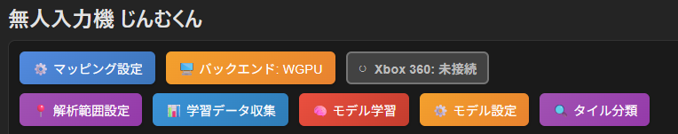
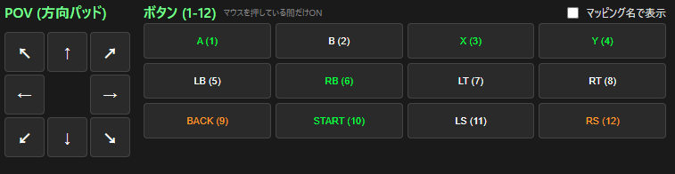
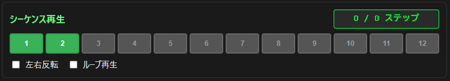
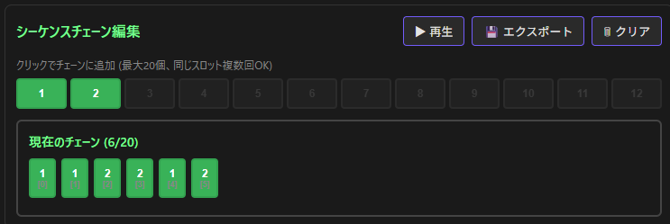
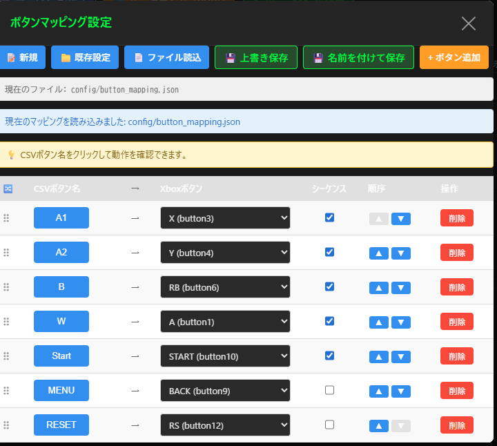

# 無人入力機　じんむくん

PCゲーム向けの高機能コマンドコントローラです。  
格闘ゲームでのトレモのさらなる充実を目指したサポートアプリケーションです。  

## 技術スタック

### アプリケーションフレームワーク

[Tauri](https://tauri.app/)を使用しています。  
フロントエンド: React + TypeScript
バックエンド: Rust

Rustが書きたかったので…と言いつつ大半はGitHub Copilotに書かせています。  
なかなか言う事聞かない箇所は手で直しました。

### 仮想USBコントローラ

[vigem-client](https://crates.io/crates/vigem-client)クレートを使用して、仮想Xbox 360コントローラーを実装しています。  
手軽に使えて感謝です。  
ドライバの仕組みもそのうち勉強したい。  

### 動画処理

[gstreamer](https://gstreamer.freedesktop.org/)を使用して動画ファイルの読み込み・フレーム取得を行っています。  
Rustバインディングもしっかりしていて、何ならvoidポインタ連発のCのAPIより、人にもAIにも使いやすいのでは?

### 機械学習フレームワーク

[Burn](https://burn.dev/learn/)を使用しています。  
様々なバックエンドをサポートしており、Wgpuも使えるのでCUDA環境がなくてもGPUを使用できるのが、特に配布に便利。  

## 主な機能

### 🎮 仮想コントローラー

仮想のX360のUSBコントローラとして動作。　　

- ワンクリックでコントローラーの接続/切断
- GUIから単発入力(確認用)
- ボタンマッピングでボタン名をわかりやすく表示可能

### 📝 入力シーケンス再生

あらかじめ記録したコマンド入力を1発再生。  
いわゆるコマンドコントローラのマクロ機能です。  

- CSV形式のシーケンスファイル
  - 新規作成
  - 編集
  - 保存
  - 読み込み
- 60fps再生
- 左右反転機能
- ループ再生対応
- マッピングに対応  
  マッピングに対応しているので、ユーザ定義のボタン名でCSVを作成可能。  
  ゲーム側のボタン設定を変えた場合も、マッピングを変えるだけで対応可能。

### 📝 シーケンスチェーン機機能

複数のシーケンスを順番を指定して並べてシーケンスチェーンを作成。  
シーケンスチェーンを再生することで、シーケンスの連続再生が可能。  

- ドラッグ&ドロップでの順番入れ替え
- シーケンスチェーン自体も左右反転やループに対応
- シーケンスチェーンをシーケンスとして保存可能

短いシーケンスを組み合わせて、ループコンボ等が効率的に編集できます。  

### 🎬 動画解析機能

動画(mp4)から入力履歴の箇所を分析し、自動で入力シーケンスを生成。

- 分析機能は機械学習で実装
  - 短い動画を準備すれば様々なゲームに対応可能
  - すべてのゲームで上手く動作するとは限りません
- 学習および分析にはGPUを使用可能
- 学習データ作成用のツールも同梱

カプコンファイティングコレクションのサイバーボッツで動作確認済み。  
各種ボタンのデザインが見分けがつきやすいものが成功しやすいです。  

同じ色のボタンに細目にボタン名が刻まれていたGGSTとかは上手く学習できませんでした。  
mp4等のエンコード時にボタンデザインが似ているため圧縮でつぶれてしまっているのが原因のようです。  
AVIみたいな無圧縮形式で撮れば上手くいくかもしれませんが、普通わざわざそんな大きなフォーマットでは撮らないと思うので実用上は難しい、というのが現在の回答です。  

---

## 📦 インストール方法

### 1. 確認済み動作環境

- **OS**: Windows 11

### 2. 事前にインストールが必要なソフトウェア

- **ViGEmBusドライバー(必須)**:  
仮想USBコントローラ。  
[ViGEmBus Releases](https://github.com/ViGEm/ViGEmBus/releases)から最新版をダウンロードしてインストール

- **GStreamerランタイム(動画解析機能用)**:  
[公式サイト](https://gstreamer.freedesktop.org/download/)からWindows用のランタイムをダウンロードしてインストール。
インストール時のオプションは以下を推奨：
  - 「Complete」インストールタイプを選択
  - 環境変数にパスを追加する

### 2. アプリケーションのインストール

#### リリース版を使用する場合（推奨）

1. [Releases](../../releases)ページから最新の`.msi`インストーラーをダウンロード
2. ダウンロードした`.msi`ファイルを実行してインストール
3. スタートメニューまたはデスクトップから「Input Player」を起動

#### ソースからビルドする場合

GStreamerはruntime版に加え、develop版も追加でインストールが必要です。  

```bash
# 必要なツールのインストール
# - Node.js (v18以上)
# - Rust (https://rustup.rs/)
# - Visual Studio Build Tools (C++開発ツール)

# リポジトリのクローン
git clone https://github.com/bodyscrap/input_player.git
cd input_player

# 依存関係のインストール
npm install

# 開発モードで起動
npm run tauri dev

# リリースビルド
npm run tauri build
```

---

## 画面説明

### メニューボタンエリア



上段左から順に

|ボタン名|説明|
|---|---|
|マッピング設定|ボタンマッピング設定画面を開く|
|バックエンド選択|バックエンド選択画面を開く|
|接続ボタン|コントローラの接続のON/OFF|
|解析範囲設定|動画解析の範囲設定画面を開く|
|学習データ収集|学習データ収集画面を開く|
|モデル学習|モデル学習画面を開く|
|モデル設定|モデル設定画面を開く|
|タイル分類|タイル分類画面を開く|

### コントローラー制御エリア



各ボタンをクリックしている間、仮想コントローラーでそのボタンが押下されます。  
クリックで行うため、現在同時押しには非対応です。  
また、アナログ入力には非対応です。  

ボタンはマッピングの設定に従い、色が付きます。  

緑 : シーケンス再生で使用するボタン
オレンジ : シーケンス再生で使用しないボタン

色がついているボタンは、「マッピング名で表示」のチェックボックスをONにすると、マッピング名で表示されます。

#### シーケンス再生エリア



12個のシーケンススロットにシーケンスをロードできます。  
シーケンスがロードされているスロットのボタンは緑色で表示されます。

**シーケンス未ロードのスロットの操作**  

|操作|説明|
|---|---|
|左クリック|シーケンスファイル読み込み画面が開きます。|
|右クリック|シーケンス編集画面が開き、新規作成ができます。|

**シーケンスロード済みのスロットの操作**  

|操作|説明|
|---|---|
|左クリック|シーケンスの再生。再生中に再度クリックで停止。|
|右クリック|シーケンス編集画面が開き、現在のシーケンスを編集できます。|
|Ctrl+右クリック|ロードされているシーケンスを破棄します。|

**左右反転チェックボックス**  

チェックすると各種シーケンス再生時に左右の入力をすべて反転して再生します。  
1P側で記録したシーケンスを2P側で再生したい場合などに使用します。  

**ループ再生チェックボックス**  

チェックするとシーケンス再生時に終了後自動で最初から再生を繰り返します。  
永久コンボの鑑賞や100本ノックなどに便利です。  

#### シーケンスチェーン制御エリア

シーケンスチェーンの編集及び再生を行います。
シーケンスチェーンを作成することで、複数のシーケンスを任意の順番で連続再生できます。  
また、左右反転とループ再生にも対応しています。  
ループ再生時はシーケンスチェーン全体がループします。  



**メニュー部**  

|ボタン名|説明|
|---|---|
|再生ボタン|現在のシーケンスチェーンを再生します。シーケンスの再生ボタン同様、再生中の押下で停止します。|
|エクスポート|現在のシーケンスチェーンを1つのシーケンスとしてファイルに保存。任意のスロットにロードします。|
|クリア|現在のシーケンスチェーンをクリアします。|
|シーケンスボタン|緑色のシーケンスボタンを押すことで、シーケンスチェーン末尾にシーケンスを追加します。|

**シーケンスチェーン表示部**  

現在のシーケンスチェーンを確認できます。  
また、ボタンをドラッグ&ドロップすることで順番の入れ替えが可能です。

### ボタンマッピング設定画面



ボタンマッピングの設定をします。  
以下の機能では事前にボタンマッピングの設定が必要です。  

- 各種シーケンス再生機能
- 機械学習機能

#### メニューボタン(最上段)

|ボタン名|説明|
|---|---|
|新規|現在のマッピングをクリアし新規にボタンマッピングを作成します。|
|既存設定|作成済みのマッピング設定を読み込みます。なお、起動時には前回適用された最新の設定ファイルが自動で読み込まれます。|
|ファイル読み込み|シーケンスファイルやモデルデータから設定を読み込みます。|
|上書き保存|現在の設定を上書き保存します。|
|名前を付けて保存|現在の設定を新しいファイル名で保存します。|
|ボタン追加|新しいボタンマッピングを追加します。短い名前を設定してください。なお、ボタン名に,やスペース、特殊文字は使用しないでください。|

#### マッピング設定

1行が1ボタンのマッピング設定になっています。  
行はドラッグすることで順番を入れ替えられます。  

|要素|説明|
|---|---|
|ボタン名|ユーザ定義のボタン名。コントローラ接続中はクリックすることで実際にボタンを押すことができます。ゲーム画面を見ながらマッピングを確認しましょう。|
|コントローラー側ボタン|仮想コントローラーのボタン。ドロップダウンから選択します。1ボタン選択のみ対応。|
|シーケンス利用<br>チェックボックス|チェックされているマッピングはシーケンス再生でも使用されます。|
|順序入れ替えボタン|ボタンの順序を1行入れ替えます。|
|削除ボタン|指定のボタンマッピングを削除します。|

#### 編集・設定エリア

**シーケンスエディタ**
- 「シーケンスエディタを開く」: 新しいウィンドウでシーケンスの編集・作成
- フレーム単位で入力を追加・削除・編集可能
- 新規シーケンスの作成やCSVとして保存

**ボタンマッピング設定**
- CSVファイルのカラム名と仮想コントローラーのボタンを対応付け
- ゲームごとに異なるボタン配置に対応

**バックエンド設定**（機械学習機能が有効な場合）
- 動画解析用の設定
- モデルのトレーニングや推論の設定F
4. 「再生」ボタンで開始、「一時停止」で停止
5. 「ループ」をONにすると繰り返し再生

### CSV再生のフォーマット

input_analyzer形式のCSVに対応しています：

```csv
duration,direction,weak_punch,middle_punch,strong_punch,weak_kick,middle_kick,strong_kick
1,5,0,0,0,0,0,0
3,6,0,0,0,0,0,0
1,5,0,1,0,0,0,0
```

- **duration**: その入力を継続するフレーム数（60fps基準）
- **direction**: テンキー方式の方向入力
  - `5`: 中立（入力なし）
  - `8`: 上, `2`: 下, `4`: 左, `6`: 右
  - `7`: 左上, `9`: 右上, `1`: 左下, `3`: 右下
- **その他のカラム**: ゲーム固有のボタン名（`0`=OFF, `1`=ON）

サンプルファイル: `sample_input/` フォルダ内

### ボタンマッピングの編集

1. アプリ上部の「設定」または「ボタンマッピング設定」をクリック
2. CSVのカラム名と仮想コントローラーのボタンを対応付け
3. 設定は `config/button_mapping.json` に保存されます

例：
```json
{
  "weak_punch": "A",
  "middle_punch": "X",
  "strong_punch": "RB",
  "weak_kick": "B",
  "middle_kick": "Y",
  "strong_kick": "RT"
}
```

### シーケンスエディタ（上級者向け）

「シーケンスエディタ」ウィンドウから：
- 新規シーケンスの作成
- 既存シーケンスの編集（フレーム単位での追加・削除）
- 複数シーケンスの管理
- 編集したシーケンスをCSVとして保存

### 動画解析機能（機械学習モデル使用）

機械学習機能を有効にしてビルドした場合：
1. 「Video Analyzer」タブを開く
2. ゲームプレイ動画をロード
3. 画面領域を指定してボタン/入力表示部分を設定
4. 「解析開始」で入力履歴を自動抽出
5. 抽出結果をCSVとして保存し、再生に使用

---

## ⚙️ 開発者向け情報

### プロジェクト構成

- `src/`: React + TypeScriptのフロントエンド
- `src-tauri/`: Rustバックエンド（コントローラー制御、CSV処理）
- `config/`: ボタンマッピングなどの設定ファイル
- `sample_input/`: サンプルCSVファイル

### 主要な依存関係

- **フロントエンド**: React, TypeScript, Vite
- **バックエンド**: Tauri, vigem-client, serde, csv
- **機械学習（オプション）**: ort (ONNX Runtime), opencv

### 機械学習機能の有効化

デフォルトでは無効になっています。有効にするには：

```bash
# フィーチャーフラグ付きでビルド
npm run tauri build -- --features ml
```

### テストとデバッグ

```bash
# 開発モードで起動
npm run tauri dev

# Rustのテスト
cd src-tauri
cargo test

# フロントエンドのテスト
npm test
```

---

## 📄 ライセンス

このプロジェクトは適切なライセンスの下で提供されています。

---

## 🤝 貢献

バグ報告や機能提案は Issues でお気軽にどうぞ。
プルリクエストも歓迎します！

---

## ⚠️ 注意事項

- このアプリケーションは教育・研究目的で作成されています
- オンライン対戦での使用は規約違反となる可能性があります
- ViGEmBusドライバーのインストールには管理者権限が必要です
- 一部のゲームではアンチチート機能により仮想コントローラーがブロックされる場合があります
